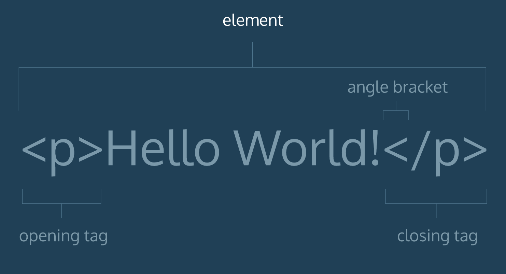

# Intro to HTML

*Note: This content is derived from Codecademy's [Intro to HTML & CSS](https://www.codecademy.com/courses/learn-html-css/lessons/structure/exercises/what-is-html?action=lesson_resume) course*

## What is HTML?

HTML is the language used to create the web pages you visit everyday. It's important to note that it's not a programming language in the traditional sense; it is a markup language, used to tell your browser how to structure the webpages you visit.

Let's analyze the acronym "HTML", as it contains a lot of useful information. HTML stands for **HyperText Markup Language**.

A markup language is a computer language that defines the structure and presentation of raw text. Markup languages work by surrounding raw text with information the computer can interpret, "marking it up" for processing.

HyperText is text displayed on a computer or device that provides access to other text through links, also known as “hyperlinks”. In fact, you probably clicked on many, many hyperlinks across the internet just to get to this page!

## Tags: the basis of all HTML

HTML is written using tags: a fancy term for labeling pieces of content. Here's an HTML tag decomposed:



Part | Definition
--- | --- | ---
Angle brackets | In HTML, the characters `<` and `>` are known as angle brackets.
HTML element | HTML code that lives inside of angle brackets.
Opening tag | The first, or opening, HTML tag used to start an HTML element.
Closing tag | The second, or closing, HTML tag used to end an HTML element. Closing tags have a forward slash (`/`) inside of them.

With the exception of a few HTML elements (we'll learn about them later!), most elements consist of an opening and closing tag.

## Building your own HTML page

### Create your structure

#### Step 1: Tell the browser that you're giving it an HTML file

A web browser must know what language a document is written in before they can process the contents of the document.

You can let web browsers know that you are using the HTML language by starting your HTML document with this document type declaration:

```html
<!DOCTYPE html>
```

This declaration is an instruction. It tells the browser what type of document to expect, along with what version of HTML is being used in the document. `<!DOCTYPE html>` must be the first line of code in all of your HTML documents.

#### Step 2: Add your HTML tags

To begin adding HTML structure and content, we must first add opening and closing <html> tags, like so:

```html
<!DOCTYPE html>
<html>

</html>
```

#### Step 3: Add <head> tags

The `<head>` element will contain information about the page that isn't displayed directly on the actual web page.

```html
<!DOCTYPE html>
<html>
  <head>

  </head>
</html>
```

#### Step 4: Add a title!

We've set up the `<head>` element; now, what kind of information about the web page should it contain?

Click on http://www.google.com and look at the top of the browser, where all of your tabs are. You should notice that the name of the tab is "Google" -- that's the title of this web page.

The browser displays the title of the page because the title can be specified directly inside of the `<head>` element, by using a `<title>` element. We do that like so:

```html
<!DOCTYPE html>
<html>
  <head>
    <title>Really Cool Page</title>
  </head>
</html>
```

#### Step 5: With a head comes a body

We've added some HTML, but still haven't seen any results in the web browser. Why is that?

Before we can add content that a browser will display, we have to add a body to the HTML file. Once the file has a body, many different types of content can be added within the body, like text, images, buttons, and much more.

Adding a `<body>` looks like this:

```html
<!DOCTYPE html>
<html>
  <head>
    <title>Really Cool Page</title>
  </head>
  <body>

  </body>
</html>
```

You've finished your HTML page structure! Now it's time for the visual stuff :)
