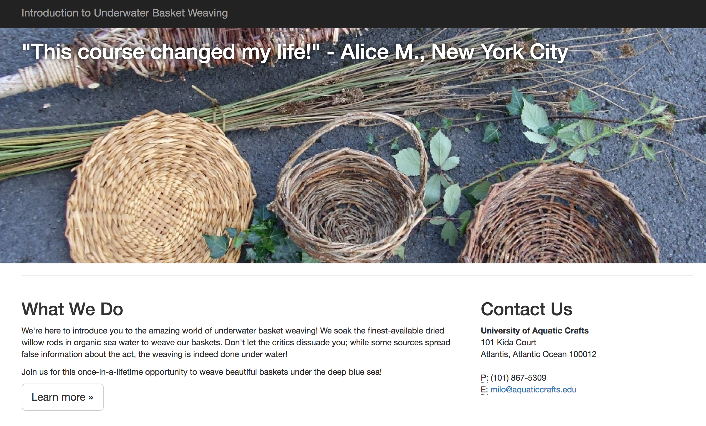
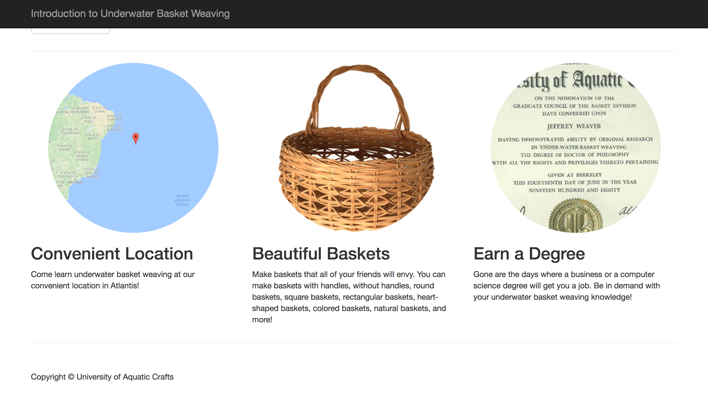

# Underwater Basket Weaving

In this lesson, we're going to take an existing HTML/CSS Bootstrap template and make it our own! Follow the instructions below to create a page for the University of Aquatic Craft's most popular course, Underwater Basket Weaving!

## 1. Add a title

The browser tab for your page should read "Underwater Basket Weaving."

Once that's done, it's onto the content!

## 2. Format the top of the page

### Add a navigation bar title

That dark gray bar across the top of your site is called a "[nav(igation) bar](https://v4-alpha.getbootstrap.com/components/navbar/)." In this case, we don't have any links, but we do want to put the name of the course, "Introduction to Underwater Basket Weaving" at the very top.

### Add a tagline

The white text underneath the nav bar in the top left corner is the course's tag line. Insert text of your choosing here -- whatever you think will get students interested in signing up for Introduction to Underwater Basket Weaving!

### Add the header image

Entice your visitors with a nice header image. Look for where you should add the link to the area designated for the header image. (Tip: there's a helpful comment in `index.html`!)

This is the image link:  
> http://www.helencampbellwillow.co.uk/uploads/1/4/0/2/14027158/7395632_orig.jpg

### Add content under "What We Do"

Under the "What We Do" section, describe what the course administrators, the University of Aquatic Crafts, is known for!

Here's some sample text to use:

 > We're here to introduce you to the amazing world of underwater basket weaving! We soak the finest-available dried willow rods in organic sea water to weave our baskets. Don't let the critics dissuade you; while some sources spread false information about the act, the weaving is indeed done under water!

 > Join us for this once-in-a-lifetime opportunity to weave beautiful baskets under the deep blue sea!

### Add contact information

Visitors will need to know who to contact to sign up for the course. In the "Contact Us" section, add the university's address, phone, and email. Take a look at the mockup at the top of this page for the relevant information.

## 3. Format the bottom of the page

Now that the top of the page is done, we want to add elements to the bottom of the page so that our visitors understand exactly how amazing Introduction to Basket Weaving really is. Fortunately, there are three sections on the page that are devoted to just that!

### Add the section content

Change the headers of each of the sections to read "Convenient Location," "Beautiful Baskets," and "Earn a Degree," respectively.

Then, fill in the content for each of the sections.

For "Convenient Location":
> Come learn underwater basket weaving at our convenient location in Atlantis!

For "Beautiful Baskets":
> Make baskets that all of your friends will envy. You can make baskets with handles, without handles, round baskets, square baskets, rectangular baskets, heart-shaped baskets, colored baskets, natural baskets, and more!

For "Earn a Degree":
> Gone are the days where a business or a computer science degree will get you a job. Be in demand with your underwater basket weaving knowledge!

Of course, you can add or edit whatever text you'd like!

### Add the section images

For every section, add a picture to represent its contents.

For "Convenient Location":
> Use the `location.png` file in the "images" folder.

For "Beautiful Baskets":
> Use the following link: `http://basketweaving.com/shopsite_sc/store/html/media/Mail2010web.jpg`.

For "Earn a Degree":
> Use the `underwater-basket-weaving-degree.jpg` file in the "images" folder.

### You're done!

Congrats! Not only have you done the University of Aquatic Crafts a huge favor, you learned a lot about navigating new, complex HTML, CSS, and Bootstrap code in the process! Now, go weave a basket in celebration :)
