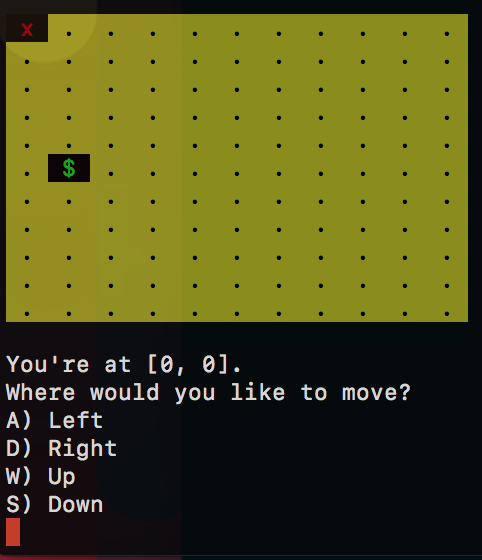
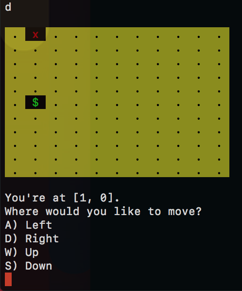
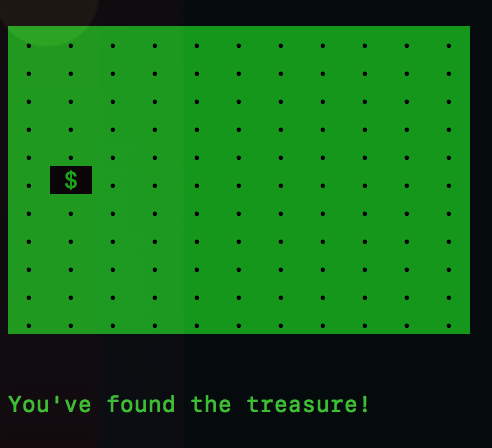
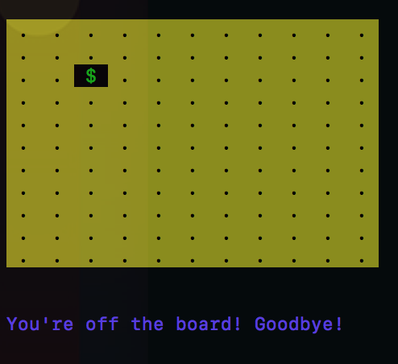
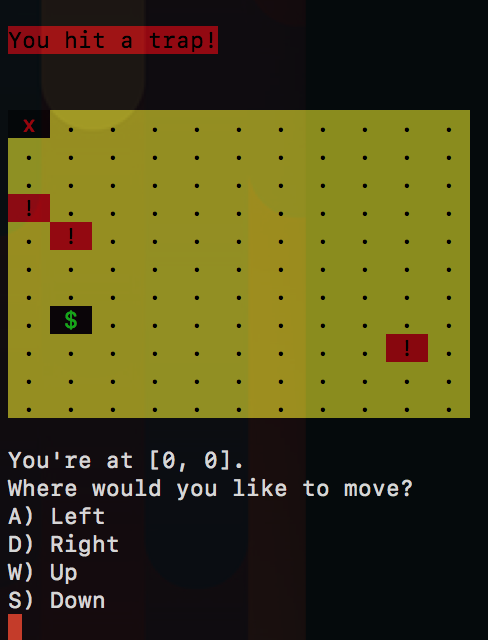

# Trap Dot
A fun little dot game (IT'S A TRAP!) to build with new coding students.

*Note: this lab is original content, created by Alex Siega (@alemosie)*

## Level 1: Dot Finder
In-code instructions found in `dot_finder_lab.rb`

### Purpose

In Dot Finder, you will build a basic dot finder game. At the start, your current position marker is located at 0,0 (marked by the "X"). Your goal is to move the marker to the treasure (marked by the "$"). When your current position marker is the same as the treasure marker, you win the game!

### Steps
As the in-code instructions in `dot_finder_lab.rb` outline, there are 5 main tasks to complete:
- **Create the game board**. Default dimensions are 10 lines across, 10 lines tall.
- **Place the current position marker**. Default position for the start of the game is at 0,0.
- **Place the treasure**. Generate random coordinates for the treasure marker on the board.
- **Create logic for completing the game**. This includes both the winning outcome (reaching the treasure) or the losing outcome (moving your marker off the board).
- **Create logic for moving the current position marker** in a specified direction (down, up, left, right) until the player has completed the game. *For an extra challenge, allow the player to move diagonally!*

The in-code instructions set up a skeleton that accounts for the 5 tasks above. However, feel free to scrap the outline in favor of a clean slate!

## Level 2: Add the traps!

In level 2, we're going to live up to the Trap Dot name, and add some traps!

Build off of the code you wrote for level 2, thinking about ways to refactor your original approach as you create new functionality. You'll code your solution to level 2 in `dot_finder_lab.rb`, right around your level 1 methods.

### Steps

Your tasks (should you choose to accept) are as follows:

- **Generate at least 2 traps randomly**. They should be randomly placed on your grid.
- **Create an easy, medium, and hard mode** that determines the size of and the number of traps in your board. At the start of the game, ask the player which mode they want.
- **Place traps on the board**. Traps should be indicated with a "!" instead of the usual "."
- Create logic to **send the current position marker back to start** when you hit a trap.

## Example game screenshots

Below are screenshots from an example version of the game. The colors are arbitrary -- check out the [`colorize`](https://github.com/fazibear/colorize) gem to make your own game pop.

#### Start

The current position marker starts at 0,0 (by default). The treasure marker is randomly placed on the board.

#### Moving to the right

The current position marker moves one space to the right to 1,0.

#### Winning the game

You win the game when your marker finds the treasure!

#### Losing the game

You lose the game at level 1 when you've moved your marker off the board.

#### Level 2 - Hitting a trap

You tell the user that they've hit a trap, and move the current position marker back to the start.

#### Skills

- Terminal interaction (asking for user input)
- Methods with arguments
- Generating random numbers
- Loops (`for`, `while`/`until`)
- Control flow with conditionals
- Game logic
